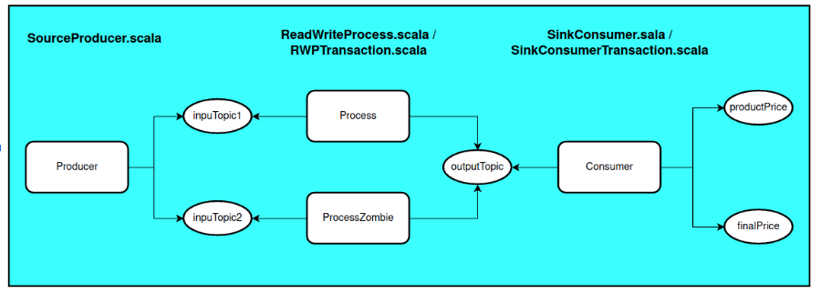
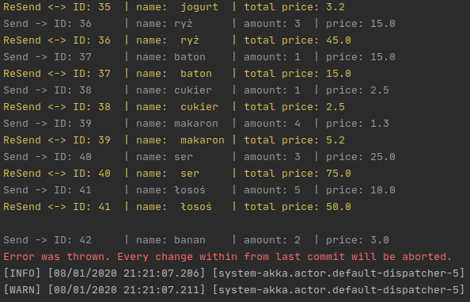
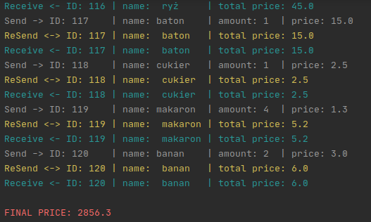
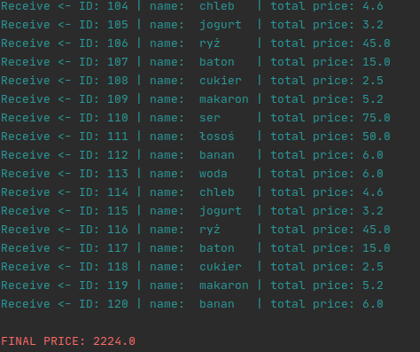
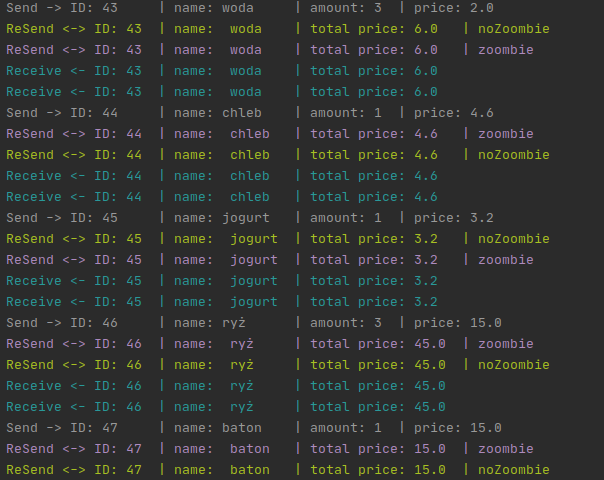
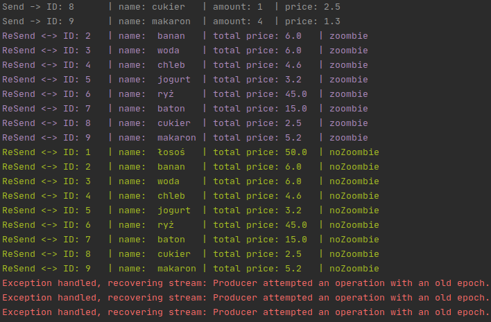

# Transactions in Alpakka Kafka
Program showing the benefits of using transactions in Alpakka Kafka.

## Technologies 
* Scala 2.12.3
* Akka Stream Kafka 2.0.4
* Kafka Stream 2.6.8
* Alpakka Kafka 
* Kafka's transactions 

## Installation
    
#### Clone    
Clone this repo to your local machine using 

#### Run docker
To install and run kafka image use docker file: 
    
```bash
sudo docker-compose -f docker-compose.yml up -d
```

## Content
Structure of the program:




From the manufacturer, the transaction receives
messages about products, calculates their price and sends them to the consumer. The consumer should receive 120 products and them total price is 2274,0.

Transactions are part of exactly once semantics and eliminate two "at least once" semantics weaknesses:
 * **_Processed data is not written atomically with corresponding offsets_**
 
   Program processes data from the input topic and commits data every 30 seconds, which ensures that the data is atomic - during an error all messages during these 30 seconds will be lost or all will be sent.
   
   In both versions, I throw exception: 
   
    

   Version without transaction: 
   
    

   Version with transaction:
   
    


    Without a transaction, the exception causes duplicates in the consumer and, as a result, an incorrect final price. 
In the transaction, despite errors, all messages will always be sent without duplicates and the final price will be correct.
 * **_No protection from evil zombies_**

      Program processes data from the input topic and commits data every 30 seconds, which ensures that the data is atomic - during an error all messages during these 30 seconds will be lost or all will be sent.
  
      Version without transaction: 
      
    

   Version with transaction:
      
    

    The non-transaction version allows the producer and zombie producers to write data, resulting in duplicates and an incorrect final price in the consumer, while the transaction version does not allow two producers to write with the same transactional id. In this case, the data stream will be restarted and the program will run without duplicates.
